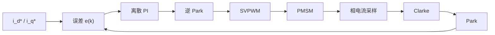

# FOC 电流环从公式到代码：离散 PI 与抗饱和

这篇既是技术笔记，也顺手演示博客的新能力：**公式渲染、流程图、代码行号与一键复制、右侧目录**。往下滚，右侧目录会跟着高亮。

## 连续域的电流环

d/q 轴电流环最常用 PI 控制器，连续域形式很干净：

$$G_c(s) = K_p + \frac{K_i}{s}$$

但代码里跑的是离散形式。用后向差分 $s \approx \frac{1 - z^{-1}}{T_s}$ 代入，得到增量式：

$$u(k) = u(k-1) + K_p\big[e(k) - e(k-1)\big] + K_i T_s\, e(k)$$

其中 $K_p$ 决定响应速度，$K_i T_s$ 决定消除稳态误差的快慢。

## 控制链路

从给定到采样反馈，一个典型的两级 FOC 电流环链路如下（这段是 Mermaid 画的，改文本即可改图）：



### 为什么用增量式

- 不需要累加历史误差，只需 $u(k-1)$、$e(k)$、$e(k-1)$ 三个量；
- 天然带积分作用，切换手自动冲击小；
- 配合输出限幅做**抗饱和（anti-windup）**更容易。

## 抗饱和

积分饱和的经典处理是把积分项钳在输出限幅内。若 $u(k)$ 被限幅到 $[u_{\min}, u_{\max}]$，则回写上一步输出：

$$u(k-1) \leftarrow \mathrm{clamp}\big(u(k),\, u_{\min},\, u_{\max}\big)$$

这样积分器不会“飞走”，退饱和更快。

## 参考实现

```c
/* 增量式 PI + 输出限幅抗饱和，Q15 定点 */
typedef struct {
    float kp, ki_ts;
    float u_prev;   /* u(k-1) */
    float e_prev;   /* e(k-1) */
    float u_min, u_max;
} pi_t;

float pi_step(pi_t *p, float e) {
    float du = p->kp * (e - p->e_prev) + p->ki_ts * e;
    float u  = p->u_prev + du;                 /* 增量式 */
    if (u > p->u_max) u = p->u_max;            /* 限幅 */
    if (u < p->u_min) u = p->u_min;
    p->e_prev = e;
    p->u_prev = u;                             /* 回写，抗饱和 */
    return u;
}
```

## 一组实测参数

| 参数 | 符号 | 取值 | 说明 |
|---|---|---|---|
| 比例增益 | $K_p$ | 0.85 | 兼顾响应与噪声 |
| 积分时间 | $T_i$ | 1.2 ms | $K_i = K_p / T_i$ |
| 控制周期 | $T_s$ | 100 µs | 即 10 kHz |
| 输出限幅 | $u_{\max}$ | ±24 V | 母线电压的一半 |

> 提示：先调 $K_p$ 到临界振荡再退 30%，最后加积分——比一上来同时调两个参数快得多。

## 小结

- 公式用 `$$…$$`（块级）或 `$…$`（行内）书写，浏览器端由 KaTeX 渲染；
- 流程图用 ` ```mermaid ` 围栏，纯文本即可出图；
- 代码块自动带**语言标签 + 行号 + 复制按钮**；
- 长文自动生成**右侧目录并滚动高亮**。
